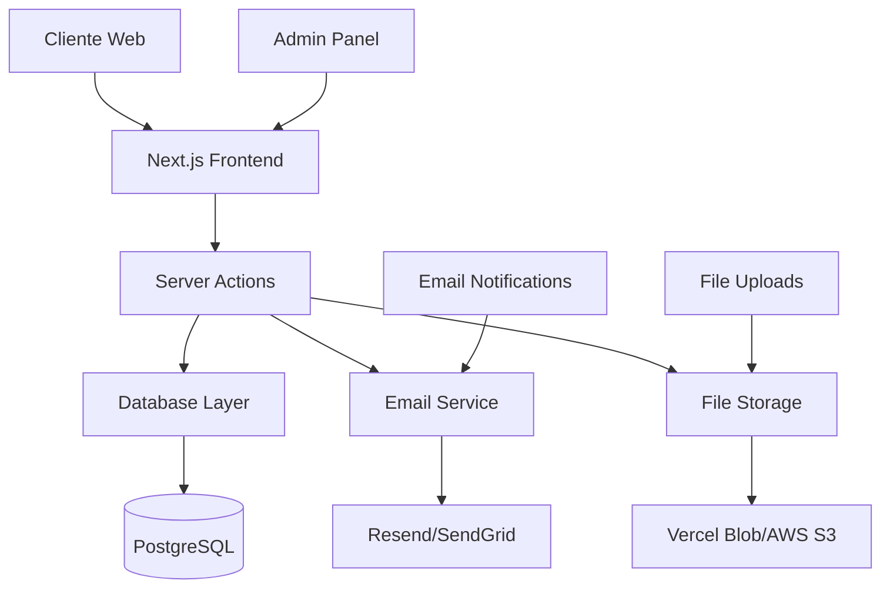

# Design Document - Sistema de Cotizaciones Online

## Overview

El Sistema de Cotizaciones Online será una aplicación web integrada al sitio de Hexágono Web que permitirá a los clientes solicitar presupuestos personalizados y al equipo gestionar estas solicitudes de manera eficiente. El sistema utilizará Next.js 15 con App Router, TypeScript, y una base de datos para persistir la información.

## Architecture

### High-Level Architecture



### Technology Stack

- **Frontend**: Next.js 15 (App Router), React 19, TypeScript
- **Styling**: Tailwind CSS, Radix UI components
- **Database**: PostgreSQL con Prisma ORM
- **Authentication**: NextAuth.js para panel admin
- **File Storage**: Vercel Blob Storage
- **Email**: Resend para notificaciones
- **Validation**: Zod para validación de schemas
- **Forms**: React Hook Form con resolvers

## Components and Interfaces

### Core Components

#### 1. QuoteRequestForm

```typescript
interface QuoteRequestFormProps {
  serviceType?: 'landing' | 'corporate' | 'ecommerce'
  onSubmit: (data: QuoteFormData) => Promise<void>
  onPriceUpdate: (estimate: PriceEstimate) => void
}

interface QuoteFormData {
  // Información del cliente
  clientInfo: {
    name: string
    email: string
    phone: string
    company?: string
  }

  // Detalles del proyecto
  projectDetails: {
    serviceType: ServiceType
    timeline: string
    budget: string
    description: string
    features: string[]
    additionalRequirements?: string
  }

  // Archivos adjuntos
  attachments: File[]
}
```

#### 2. PriceCalculator

```typescript
interface PriceCalculatorProps {
  serviceType: ServiceType
  selectedFeatures: string[]
  onPriceChange: (estimate: PriceEstimate) => void
}

interface PriceEstimate {
  basePrice: number
  additionalFeatures: FeatureCost[]
  totalEstimate: number
  currency: 'ARS'
  disclaimer: string
}
```

#### 3. QuoteTracker

```typescript
interface QuoteTrackerProps {
  quoteId: string
  accessToken: string
}

interface QuoteStatus {
  id: string
  status: 'pending' | 'in_review' | 'quoted' | 'completed' | 'cancelled'
  createdAt: Date
  updatedAt: Date
  estimatedResponse: Date
  messages: StatusMessage[]
}
```

#### 4. AdminQuotePanel

```typescript
interface AdminQuotePanelProps {
  quotes: Quote[]
  onStatusUpdate: (quoteId: string, status: QuoteStatus) => Promise<void>
  onAddNote: (quoteId: string, note: string) => Promise<void>
}

interface Quote {
  id: string
  clientInfo: ClientInfo
  projectDetails: ProjectDetails
  status: QuoteStatus
  priority: 'low' | 'medium' | 'high'
  assignedTo?: string
  internalNotes: Note[]
  attachments: Attachment[]
  createdAt: Date
}
```

### Database Schema

#### Tables Structure

```sql
-- Tabla principal de cotizaciones
CREATE TABLE quotes (
  id UUID PRIMARY KEY DEFAULT gen_random_uuid(),
  quote_number VARCHAR(20) UNIQUE NOT NULL,
  client_name VARCHAR(255) NOT NULL,
  client_email VARCHAR(255) NOT NULL,
  client_phone VARCHAR(50),
  client_company VARCHAR(255),
  service_type VARCHAR(50) NOT NULL,
  project_description TEXT,
  timeline VARCHAR(100),
  budget_range VARCHAR(100),
  estimated_price DECIMAL(10,2),
  status VARCHAR(50) DEFAULT 'pending',
  priority VARCHAR(20) DEFAULT 'medium',
  assigned_to VARCHAR(255),
  access_token VARCHAR(100) UNIQUE NOT NULL,
  created_at TIMESTAMP DEFAULT NOW(),
  updated_at TIMESTAMP DEFAULT NOW()
);

-- Características seleccionadas
CREATE TABLE quote_features (
  id UUID PRIMARY KEY DEFAULT gen_random_uuid(),
  quote_id UUID REFERENCES quotes(id) ON DELETE CASCADE,
  feature_name VARCHAR(255) NOT NULL,
  feature_cost DECIMAL(10,2),
  created_at TIMESTAMP DEFAULT NOW()
);

-- Archivos adjuntos
CREATE TABLE quote_attachments (
  id UUID PRIMARY KEY DEFAULT gen_random_uuid(),
  quote_id UUID REFERENCES quotes(id) ON DELETE CASCADE,
  filename VARCHAR(255) NOT NULL,
  original_name VARCHAR(255) NOT NULL,
  file_size INTEGER NOT NULL,
  mime_type VARCHAR(100) NOT NULL,
  storage_url TEXT NOT NULL,
  created_at TIMESTAMP DEFAULT NOW()
);

-- Notas internas del equipo
CREATE TABLE quote_notes (
  id UUID PRIMARY KEY DEFAULT gen_random_uuid(),
  quote_id UUID REFERENCES quotes(id) ON DELETE CASCADE,
  author VARCHAR(255) NOT NULL,
  note TEXT NOT NULL,
  is_internal BOOLEAN DEFAULT true,
  created_at TIMESTAMP DEFAULT NOW()
);

-- Historial de cambios de estado
CREATE TABLE quote_status_history (
  id UUID PRIMARY KEY DEFAULT gen_random_uuid(),
  quote_id UUID REFERENCES quotes(id) ON DELETE CASCADE,
  previous_status VARCHAR(50),
  new_status VARCHAR(50) NOT NULL,
  changed_by VARCHAR(255) NOT NULL,
  notes TEXT,
  created_at TIMESTAMP DEFAULT NOW()
);
```

### Routes Structure

#### Public Routes (Spanish URLs)

```
app/
├── cotizacion/
│   ├── page.tsx                    # Formulario de cotización
│   ├── exito/
│   │   └── page.tsx               # Página de confirmación
│   └── seguimiento/
│       └── [token]/
│           └── page.tsx           # Seguimiento público
├── admin/
│   ├── cotizaciones/
│   │   ├── page.tsx               # Lista de cotizaciones
│   │   ├── [id]/
│   │   │   └── page.tsx          # Detalle de cotización
│   │   └── reportes/
│   │       └── page.tsx          # Reportes y analytics
│   └── layout.tsx                 # Layout con autenticación
```

#### API Routes (English for code)

```
app/
├── api/
│   ├── quotes/
│   │   ├── route.ts                 # POST: crear cotización
│   │   ├── [id]/
│   │   │   ├── route.ts            # GET: obtener cotización
│   │   │   ├── status/route.ts     # PATCH: actualizar estado
│   │   │   └── notes/route.ts      # POST: agregar nota
│   │   ├── track/
│   │   │   └── [token]/route.ts    # GET: seguimiento público
│   │   └── admin/
│   │       ├── route.ts            # GET: listar todas
│   │       └── reports/route.ts    # GET: reportes
│   ├── upload/
│   │   └── route.ts                # POST: subir archivos
│   └── pricing/
│       └── calculate/route.ts      # POST: calcular precio
```

## Data Models

### Prisma Schema

```prisma
model Quote {
  id            String   @id @default(cuid())
  quoteNumber   String   @unique @map("quote_number")
  clientName    String   @map("client_name")
  clientEmail   String   @map("client_email")
  clientPhone   String?  @map("client_phone")
  clientCompany String?  @map("client_company")

  serviceType   ServiceType @map("service_type")
  description   String?
  timeline      String?
  budgetRange   String?   @map("budget_range")

  estimatedPrice Decimal? @map("estimated_price")
  status        QuoteStatus @default(PENDING)
  priority      Priority    @default(MEDIUM)
  assignedTo    String?     @map("assigned_to")
  accessToken   String      @unique @map("access_token")

  features      QuoteFeature[]
  attachments   QuoteAttachment[]
  notes         QuoteNote[]
  statusHistory QuoteStatusHistory[]

  createdAt DateTime @default(now()) @map("created_at")
  updatedAt DateTime @updatedAt @map("updated_at")

  @@map("quotes")
}

model QuoteFeature {
  id          String  @id @default(cuid())
  quoteId     String  @map("quote_id")
  featureName String  @map("feature_name")
  featureCost Decimal @map("feature_cost")

  quote Quote @relation(fields: [quoteId], references: [id], onDelete: Cascade)

  createdAt DateTime @default(now()) @map("created_at")

  @@map("quote_features")
}

enum ServiceType {
  LANDING_PAGE
  CORPORATE_WEB
  ECOMMERCE
  SOCIAL_MEDIA
}

enum QuoteStatus {
  PENDING
  IN_REVIEW
  QUOTED
  COMPLETED
  CANCELLED
}

enum Priority {
  LOW
  MEDIUM
  HIGH
}
```

## Error Handling

### Error Types and Responses

```typescript
// Tipos de errores específicos
export class QuoteValidationError extends Error {
  constructor(public field: string, message: string) {
    super(message)
    this.name = 'QuoteValidationError'
  }
}

export class QuoteNotFoundError extends Error {
  constructor(quoteId: string) {
    super(`Quote with ID ${quoteId} not found`)
    this.name = 'QuoteNotFoundError'
  }
}

// Manejo centralizado de errores
export function handleApiError(error: unknown): Response {
  if (error instanceof QuoteValidationError) {
    return NextResponse.json({ error: error.message, field: error.field }, { status: 400 })
  }

  if (error instanceof QuoteNotFoundError) {
    return NextResponse.json({ error: error.message }, { status: 404 })
  }

  // Error genérico
  console.error('Unexpected error:', error)
  return NextResponse.json({ error: 'Error interno del servidor' }, { status: 500 })
}
```

### Client-Side Error Handling

```typescript
// Hook para manejo de errores en formularios
export function useQuoteForm() {
  const [errors, setErrors] = useState<Record<string, string>>({})
  const [isSubmitting, setIsSubmitting] = useState(false)

  const submitQuote = async (data: QuoteFormData) => {
    try {
      setIsSubmitting(true)
      setErrors({})

      const response = await fetch('/api/quotes', {
        method: 'POST',
        headers: { 'Content-Type': 'application/json' },
        body: JSON.stringify(data),
      })

      if (!response.ok) {
        const errorData = await response.json()
        if (errorData.field) {
          setErrors({ [errorData.field]: errorData.error })
        } else {
          throw new Error(errorData.error)
        }
        return
      }

      const result = await response.json()
      return result
    } catch (error) {
      setErrors({ general: 'Error al enviar la cotización. Intente nuevamente.' })
    } finally {
      setIsSubmitting(false)
    }
  }

  return { submitQuote, errors, isSubmitting }
}
```

## Testing Strategy

### Unit Tests

- Validación de schemas con Zod
- Cálculo de precios
- Utilidades de formateo
- Hooks personalizados

### Integration Tests

- API routes completas
- Flujo de creación de cotizaciones
- Sistema de notificaciones
- Subida de archivos

### E2E Tests

- Flujo completo de solicitud de cotización
- Panel administrativo
- Sistema de seguimiento
- Responsive design

### Test Structure

```typescript
// __tests__/api/quotes.test.ts
describe('/api/quotes', () => {
  describe('POST', () => {
    it('should create a new quote with valid data', async () => {
      const quoteData = {
        clientInfo: {
          name: 'Juan Pérez',
          email: 'juan@example.com',
          phone: '+54 11 1234-5678',
        },
        projectDetails: {
          serviceType: 'corporate',
          timeline: '4-6 weeks',
          description: 'Sitio web corporativo',
        },
      }

      const response = await request(app).post('/api/quotes').send(quoteData).expect(201)

      expect(response.body).toHaveProperty('quoteNumber')
      expect(response.body).toHaveProperty('accessToken')
    })

    it('should return validation error for invalid email', async () => {
      const invalidData = {
        clientInfo: {
          name: 'Juan Pérez',
          email: 'invalid-email',
        },
      }

      const response = await request(app).post('/api/quotes').send(invalidData).expect(400)

      expect(response.body.field).toBe('email')
    })
  })
})
```

## Security Considerations

### Data Protection

- Validación estricta de inputs con Zod
- Sanitización de archivos subidos
- Rate limiting en endpoints públicos
- Tokens de acceso únicos para seguimiento

### Authentication & Authorization

- NextAuth.js para panel administrativo
- Middleware de autenticación en rutas admin
- Roles y permisos para diferentes niveles de acceso

### File Upload Security

```typescript
// Validación de archivos
const ALLOWED_TYPES = ['image/jpeg', 'image/png', 'application/pdf', 'application/msword']
const MAX_FILE_SIZE = 10 * 1024 * 1024 // 10MB

export function validateFile(file: File): string | null {
  if (!ALLOWED_TYPES.includes(file.type)) {
    return 'Tipo de archivo no permitido'
  }

  if (file.size > MAX_FILE_SIZE) {
    return 'El archivo excede el tamaño máximo de 10MB'
  }

  return null
}
```

## Performance Optimizations

### Frontend Optimizations

- Server Components para contenido estático
- Client Components solo donde sea necesario
- Lazy loading de componentes pesados
- Optimización de imágenes con Next.js Image

### Backend Optimizations

- Índices de base de datos en campos frecuentemente consultados
- Paginación en listados de cotizaciones
- Caching de cálculos de precios
- Compresión de respuestas API

### Database Optimizations

```sql
-- Índices para mejorar performance
CREATE INDEX idx_quotes_status ON quotes(status);
CREATE INDEX idx_quotes_created_at ON quotes(created_at DESC);
CREATE INDEX idx_quotes_client_email ON quotes(client_email);
CREATE INDEX idx_quotes_access_token ON quotes(access_token);
```

## Deployment Considerations

### Environment Variables

```env
# Database
DATABASE_URL="postgresql://..."

# Email Service
RESEND_API_KEY="re_..."

# File Storage
BLOB_READ_WRITE_TOKEN="vercel_blob_..."

# Authentication
NEXTAUTH_SECRET="..."
NEXTAUTH_URL="https://hexagono.xyz"

# App Configuration
NEXT_PUBLIC_APP_URL="https://hexagono.xyz"
ADMIN_EMAIL="admin@hexagono.xyz"
```

### Monitoring and Analytics

- Error tracking con Sentry
- Performance monitoring
- Email delivery tracking
- Conversion analytics
