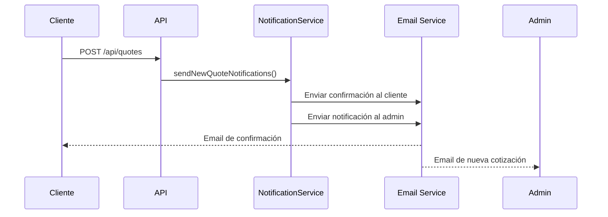
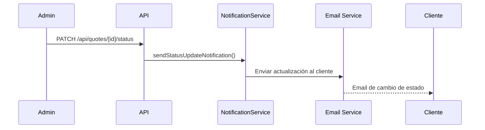
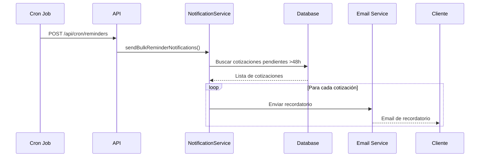

# Sistema de Notificaciones por Email

## Descripción General

El sistema de notificaciones por email del Sistema de Cotizaciones Online permite enviar comunicaciones automáticas a clientes y administradores durante el ciclo de vida de una cotización.

## Componentes Principales

### 1. Servicio de Email (`lib/email.ts`)

Configuración base para el envío de emails usando Resend:

- **Configuración**: Manejo de credenciales y configuración de Resend
- **Envío de emails**: Función principal con retry automático
- **Validación**: Validación de direcciones de email
- **Formateo**: Formateo de precios y datos para emails

### 2. Templates de Email (`lib/email-templates.ts`)

Templates HTML y texto plano para diferentes tipos de notificaciones:

#### Templates Disponibles

1. **Confirmación de Cotización al Cliente**
   - Se envía cuando se crea una nueva cotización
   - Incluye número de cotización, detalles del servicio y enlace de seguimiento

2. **Notificación al Administrador**
   - Se envía al equipo cuando llega una nueva cotización
   - Marca cotizaciones de alta prioridad (>$300.000 ARS)
   - Incluye enlace directo al panel administrativo

3. **Actualización de Estado**
   - Se envía al cliente cuando cambia el estado de su cotización
   - Mensajes personalizados según el nuevo estado

4. **Recordatorio Automático**
   - Se envía después de 48 horas si la cotización sigue pendiente
   - Incluye información de contacto para consultas adicionales

### 3. Servicio de Notificaciones (`lib/notifications.ts`)

Orquesta el envío de notificaciones:

- **Notificaciones de nueva cotización**: Cliente + Administrador
- **Notificaciones de cambio de estado**: Solo cliente
- **Recordatorios automáticos**: Individuales y masivos
- **Notificaciones de alta prioridad**: Solo administrador

### 4. Endpoints de API

#### `/api/cron/reminders`
- **POST**: Endpoint para cron jobs de recordatorios automáticos
- **GET**: Endpoint de testing (solo desarrollo)
- Autenticación mediante `CRON_SECRET`

#### `/api/quotes/[id]/status`
- **PATCH**: Actualiza estado y envía notificación automática
- **GET**: Obtiene historial de estados

#### `/api/quotes/[id]/reminder`
- **POST**: Envía recordatorio manual para una cotización específica

## Configuración

### Variables de Entorno Requeridas

```env
# Resend API Key
RESEND_API_KEY="re_your_api_key_here"

# Emails de configuración
COMPANY_EMAIL="contacto@hexagono.xyz"
ADMIN_EMAIL="admin@hexagono.xyz"

# URL base de la aplicación
NEXT_PUBLIC_APP_URL="https://hexagono.xyz"

# Secret para cron jobs
CRON_SECRET="your_secure_cron_secret_here"
```

### Configuración de Cron Jobs

Para Vercel, el archivo `vercel.json` incluye:

```json
{
  "crons": [
    {
      "path": "/api/cron/reminders",
      "schedule": "0 */12 * * *"
    }
  ]
}
```

Esto ejecuta recordatorios cada 12 horas.

## Flujo de Notificaciones

### 1. Nueva Cotización



### 2. Cambio de Estado



### 3. Recordatorios Automáticos



## Tipos de Email

### 1. Confirmación de Cotización (Cliente)

**Cuándo se envía**: Inmediatamente después de crear una cotización

**Contenido**:
- Saludo personalizado
- Número de cotización único
- Detalles del servicio solicitado
- Estimación preliminar de precio
- Enlace de seguimiento
- Información de contacto
- Tiempo estimado de respuesta (24-48 horas)

### 2. Notificación de Nueva Cotización (Admin)

**Cuándo se envía**: Inmediatamente después de crear una cotización

**Contenido**:
- Indicador de prioridad (🔥 URGENTE para >$300k ARS)
- Detalles completos de la cotización
- Información del cliente
- Enlace directo al panel administrativo
- Lista de próximos pasos

### 3. Actualización de Estado (Cliente)

**Cuándo se envía**: Cuando un administrador cambia el estado de la cotización

**Contenido**:
- Estado actual de la cotización
- Mensaje personalizado (opcional)
- Enlace de seguimiento actualizado
- Mensajes especiales para estados específicos:
  - **QUOTED**: "¡Tu cotización está lista!"
  - **COMPLETED**: "¡Cotización completada!"

### 4. Recordatorio (Cliente)

**Cuándo se envía**: 48 horas después de crear la cotización si sigue pendiente

**Contenido**:
- Recordatorio amigable del estado de la cotización
- Información de contacto para consultas adicionales
- Enlace de seguimiento
- Invitación a proporcionar información adicional

## Características Técnicas

### Retry Logic

Todos los emails incluyen lógica de reintento:
- Máximo 3 intentos por defecto
- Backoff exponencial (1s, 2s, 4s)
- Logging detallado de errores

### Manejo de Errores

- Los errores de email no bloquean la creación de cotizaciones
- Logging completo para debugging
- Fallback graceful en caso de fallas del servicio

### Seguridad

- Validación de direcciones de email
- Autenticación de cron jobs mediante secret
- Rate limiting en endpoints públicos
- Sanitización de contenido

### Performance

- Envío asíncrono de notificaciones
- Procesamiento en lotes para recordatorios masivos
- Límite de concurrencia para evitar rate limiting
- Delays entre lotes para optimizar rendimiento

## Testing

### Tests Unitarios

- Validación de templates
- Formateo de datos
- Lógica de retry
- Manejo de errores

### Tests de Integración

- Endpoints de API completos
- Flujo de notificaciones end-to-end
- Cron jobs y recordatorios

### Tests E2E

- Flujo completo de cotización con notificaciones
- Verificación de emails en diferentes estados
- Testing de recordatorios automáticos

## Monitoreo y Logs

### Logs Importantes

```typescript
// Creación exitosa de cotización
console.log('Quote notifications sent:', {
  quoteId,
  quoteNumber,
  clientNotified: boolean,
  adminNotified: boolean,
})

// Cambio de estado
console.log('Status update notification sent:', {
  quoteId,
  quoteNumber,
  previousStatus,
  newStatus,
  notificationSent: boolean,
})

// Recordatorios masivos
console.log('Bulk reminder notifications completed:', {
  processed: number,
  successful: number,
  failed: number,
})
```

### Métricas Recomendadas

- Tasa de entrega de emails
- Tiempo de respuesta del servicio de email
- Número de recordatorios enviados por día
- Tasa de error en notificaciones

## Troubleshooting

### Problemas Comunes

1. **Emails no se envían**
   - Verificar `RESEND_API_KEY`
   - Revisar logs de error
   - Confirmar configuración de dominio en Resend

2. **Recordatorios no funcionan**
   - Verificar configuración de cron
   - Confirmar `CRON_SECRET`
   - Revisar logs del endpoint `/api/cron/reminders`

3. **Templates se ven mal**
   - Verificar CSS inline
   - Probar en diferentes clientes de email
   - Validar HTML con herramientas online

### Debugging

```bash
# Test manual de recordatorios (desarrollo)
curl http://localhost:3000/api/cron/reminders

# Test de endpoint de estado
curl -X PATCH http://localhost:3000/api/quotes/[id]/status \
  -H "Content-Type: application/json" \
  -d '{"status": "IN_REVIEW", "changedBy": "admin"}'
```

## Roadmap Futuro

### Mejoras Planificadas

1. **Templates Personalizables**
   - Editor visual de templates
   - Variables dinámicas
   - A/B testing de contenido

2. **Notificaciones Avanzadas**
   - SMS via Twilio
   - Push notifications
   - Webhooks para integraciones

3. **Analytics**
   - Tracking de apertura de emails
   - Métricas de engagement
   - Dashboard de notificaciones

4. **Automatización Avanzada**
   - Workflows personalizables
   - Triggers basados en comportamiento
   - Segmentación de audiencia

## Conclusión

El sistema de notificaciones por email proporciona una comunicación fluida y profesional entre Hexágono Web y sus clientes potenciales, automatizando el proceso de seguimiento y mejorando la experiencia del usuario durante el proceso de cotización.